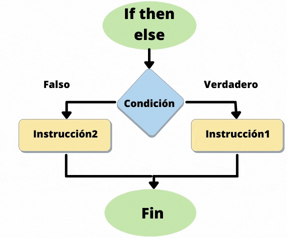
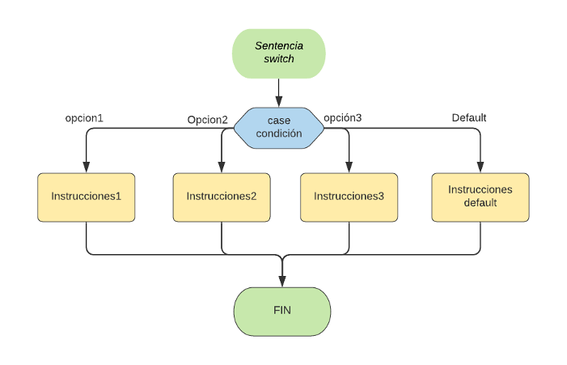
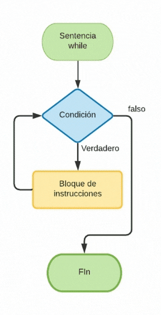
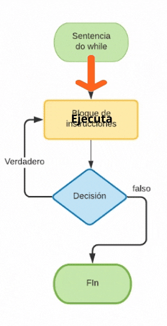
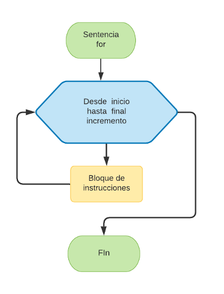

# Índice

[TOC]

------

# Evolución de la programación

En los inicios de la programación, se usaban mucho las sentencias **GOTO**, que básicamente le decían al programa "salta a esta línea". Esto provocaba que el código fuera un desastre, lleno de saltos desordenados que hacían muy difícil entender y mantener el programa. A esto se le llamaba **programación espagueti**.

Con el tiempo, la programación evolucionó hacia un enfoque más organizado llamado **programación estructurada**. En lugar de usar saltos caóticos, se empezaron a usar estructuras de control como **if-else**, **bucles** y **funciones**, lo que hizo que el código fuera más fácil de leer, entender y mantener. Fue un gran avance que cambió el mundo de la programación y nos llevó a los lenguajes modernos como Java.


---

# Contadores y Acumuladores

Cuando programamos, muchas veces necesitamos **contar** cosas o **acumular** valores. Para esto, usamos **contadores** y **acumuladores**. Vamos a ver qué son y cómo funcionan.

Aunque parezca algo que vamos a hacer muy de vez en cuando, **son los pilares básicos** de toda la programación. Por eso es muy importante que los dominemos a fondo. Para las instrucciones repetitivas serán esenciales para saber cuando parar de repetir alguna instrucción.

## Contadores: Sumando de uno en uno

Un **contador** es una variable que se encarga de **contar** cuántas veces ocurre algo. Por lo general, va sumando de uno en uno.

Por ejemplo, imagina que quieres contar cuántas vueltas da un lazo. Empezamos con un número (cero, normalmente) y vamos sumando uno en cada vuelta:

```java
int contador = 0;  // Empezamos en cero

contador = contador + 1;  // Sumamos 1. Ahora vale 1
contador = contador + 1;  // Sumamos otro 1. Ahora vale 2
contador = contador + 1;  // ¡Otra vez sumamos 1!. Ahora vale 3
```

En cada línea, el contador aumenta en uno. ¡Así de simple!

## Acumuladores: Sumando todo lo que pasa

Un **acumulador** hace algo parecido, pero en lugar de sumar siempre 1, puede ir sumando cualquier valor. Es como una hucha donde vas metiendo dinero de diferentes cantidades.

Por ejemplo, si quieres ir sumando las puntuaciones en un juego, puedes hacerlo así:

```java
int puntuacionTotal = 0;  // Empezamos con una puntuación de cero

puntuacionTotal = puntuacionTotal + 5;  // Sumamos 5 puntos
puntuacionTotal = puntuacionTotal + 8;  // Ahora sumamos 8 puntos
puntuacionTotal = puntuacionTotal + 3;  // ¡Y sumamos 3 más! Ahora vale 16
```

Aquí, en lugar de sumar siempre 1, estamos sumando diferentes cantidades. Eso es un acumulador.

> [!note]
>
> Aunque el valor inicial para un contador o acumulador suele ser `0`, pueden comenzar en el valor que tu código necesite. Hasta pueden empezar con valores negativos.

## Simplificando

En Java, hay formas más cortas de escribir estas operaciones. Puedes escribirlos de la forma completa o usar los atajos para hacer tu código más corto y fácil de leer.

| Atajo    | Explicación                      | Equivalente Completo | Descripción                                                  |
| -------- | -------------------------------- | -------------------- | ------------------------------------------------------------ |
| `i++`    | Sumar 1 a `i` después de usarla  | `i = i + 1`          | Incrementa el valor de `i` **después** de usarla en la expresión. |
| `++i`    | Sumar 1 a `i` antes de usarla    | `i = i + 1`          | Incrementa el valor de `i` **antes** de usarla en la expresión. |
| `i--`    | Restar 1 a `i` después de usarla | `i = i - 1`          | Decrementa el valor de `i` **después** de usarla en la expresión. |
| `--i`    | Restar 1 a `i` antes de usarla   | `i = i - 1`          | Decrementa el valor de `i` **antes** de usarla en la expresión. |
| `i += x` | Sumar `x` a `i`                  | `i = i + x`          | Incrementa `i` por el valor de `x`.                          |
| `i -= x` | Restar `x` a `i`                 | `i = i - x`          | Decrementa `i` por el valor de `x`.                          |

> [!tip]
>
> 😎Sabemos que los atajos hacen que tus códigos molen mucho más pero se aconseja usarlos solo cuando ya domines las estructuras básicas. 
>
> “**El lado oscuro no es más fuerte, es el camino rápido, fácil y seductor**”

---

# Tipos de instrucciones

Cada línea que escribimos en un programa es una instrucción o sentencia. Estas instrucciones pueden ser:

- **Declaraciones:** Sirven para definir (crear) una variable o funciones en un programa.
- **Primitivas**: Son acciones sobre los datos de los programas. A su vez puede ser:
  - **De asignación:** Cuando asignamos un valor a una variable.
  - **De Entrada o Salida (E/S):** Cuando mostramos una expresión por pantalla o leemos por teclado. La pantalla y el teclado son las E/S estándar, pero podría ser cualquier otro dispositivo.
- **Control:** Sirven para alterar y controlar el orden de ejecución de un programa. En general, todos los programas se ejecutan secuencialmente línea a línea, y gracias a estas estructuras el flujo del programa puede depender de ciertas condiciones que nosotros elijamos.


**Ejemplo de instrucción de declaración:**

```java
String curso = "Java";
```

**Ejemplo de instrucción de asignación:**

```java
curso = curso + "SE por Salva Márquez";
```

**Ejemplo de instrucciones de E/S:**

```java
System.out.print("Introduzca su edad: ");	//Instrucción de SALIDA
int edad = scanner.nextInt();				//Instrucción de ENTRADA
```

**Ejemplo de instrucción de control:**

```java
//Si la expresión es verdadera, se ejecuta la primera sentencia
//en caso contrario, la segunda.
if (gremlinBueno == true && hora > 12 && hora < 23) {
    System.out.println("No es hora de comer"); 
} else {
    System.out.println("Puedes comer un poquito");
}
```

Veamos a fondo las distintas instrucciones de control en Java en el siguiente apartado.

---

# Instrucciones de control

Todas las instrucciones anteriormente vistas, son secuenciales. Se ejecutan una tras otra y en ningún momento se varia el flujo del programa. Pero la **programación estructurada permite el uso de condiciones y de repeticiones**.

Estas instrucciones permiten que ciertas líneas de código se ejecuten o no, dependiendo de una condición (**instrucciones condicionales**), e incluso repetidamente hasta o mientras se cumpla una condición (**instrucciones repetitivas**). En definitiva son instrucciones que permiten variar el flujo normal del programa dependiendo de que el resultado de la expresión lógica sea `TRUE` o `FALSE`.


## Instrucción condicional simple

Se crea con la instrucción <kbd>if</kbd>. Evalúa una expresión lógica y dependiendo del resultado, ejecuta un bloque de instrucciones o no. 

**Sintaxis:**

```java
if (condicion) {
    instrucción1;
    instruccion2;
    ...
}
```

**Ejemplo:**

```java
//Ejemplo de instrucción IF
if (hora >= 7 && hora <= 11 ) {
    System.out.println("Buenos días");
    saludo++;
}
```

Dependiendo del valor de la variable `hora`, se ejecutarán las instrucciones delimitadas por las llaves `{ … }`, también llamado **bloque**. Se evalúa la expresión entre los paréntesis `(…)`, si el resultado es `true`, se ejecutan las líneas 3 y 4. Si el resultado es `false`, se ignorará todo el bloque y la ejecución seguirá por la línea 5.

La condición podrá ser más simple o más compleja, pero su resultado deberá ser siempre `true` o `false`.

La primera instrucción que va dentro de un bloque, empieza con un espaciado hacia la derecha con la tecla `tab`. Todas las instrucciones siguientes irán debajo al mismo nivel. Esto nos ayudará a identificar rápidamente las instrucciones que están dentro de un bloque y las que no. A este proceso se la llama **indentación**. Aunque el programa compilará exactamente igual si se cumple esta norma o no, es de suma importancia respetar la indentación.

## Instrucción condicional doble

Se crea con la instrucción <kbd>if … else</kbd>. Es una variante del condicional simple, en la que se ejecutan unas instrucciones si la expresión da `true`, y otras instrucciones si es `false`. En la condicional simple no se ejecuta ningún bloque concreto de instrucciones en caso de que el resultado sea `false`.



**Sintaxis:**

```java
if (condicion) {
    instrucciones si true;
    ...
} else {
    instrucciones si false;
    ...
}
```

**Ejemplo:**

```java
if (hora >= 7 && hora <= 20 ) {
    System.out.println("Buenos días");
    buenosDias++;
} else {
    System.out.println("Buenas noches");
	buenasNoches++;
}
```

Dependiendo del valor de la variable `hora`, si está entre los valores 7 y 20, se imprimirá por pantalla `"Buenos días"`, en cualquier otro caso, `"Buenas noches"`. 

El bloque `else` de una instrucción de tipo `if` es opcional. Cada bloque de instrucciones tiene sus propias llaves, y aunque se puedan escribir con otra sintaxis (por ejemplo, escribir todas las llaves al inicio de la línea), se aconseja que se use tal cual está en el ejemplo.

Hay que tener en cuenta que se pueden incluir instrucciones `if` unas dentro de otras. A eso se le llaman **if anidados**.

```java
...
String mensaje = "";
if (nota < 5) {
    mensaje += "Has suspendido";
} else {
    if (nota >=5 && nota < 6) {
        mensaje += "Tienes un SUFICIENTE";
    } else {
        if (nota >= 6 && nota < 7) {
        	mensaje += "Tienes un BIEN";
        } else {
            if (nota >= 7 && nota < 9) {
                mensaje += "Tienes un NOTABLE";
            } else {
                mensaje += "Tienes un SOBRESALIENTE";
            }
        }
    }
}
...
```

Al anidar estas instrucciones hay que tener en cuenta que habrá que cerrar los bloques interiores antes que los exteriores. Hay IDEs que nos ayudan, por ejemplo con líneas verticales para mantener la indentación o usando colores distintos para las llaves de distintos bloques.


## Instrucción condicional compuesta

Se crea con la instrucción <kbd>switch</kbd>. En muchas ocasiones hay que valorar expresiones que como resultado pueden dar muchos valores distintos, no sólo verdadero o falso. Se pueden hacer instrucciones `if` anidadas, pero para estos casos existe una instrucción que evalúa una expresión (matemática o lógica) y según los diferentes valores que toma se ejecutan unas u otras instrucciones. 



Su funcionamiento sería el siguiente:

**Sintaxis:**

```java
switch (expresión) {
    case valor1:
        instrucciones;
        ...
		break;
    case valor2: 
        ...
		break;
    default:
        instrucciones en otro caso;
        ...
}
```

**Ejemplo:**

```java
int diaNumero = 5;
String diaPalabra;
switch (diaNumero) {
    case 1:
        diaPalabra = "Lunes";
        break;
    case 2:
        diaPalabra = "Martes";
        break;  
    case 3:
        diaPalabra = "Miércoles";
        break;
    case 4:
        diaPalabra = "Jueves";
        break;
    case 5:
        diaPalabra = "Viernes";
        break;
    case 6:
    case 7: 
        diaPalabra = "Fin de semana";
        break;
    default:
        diaPalabra = "Error: No es un día de la semana válido";
}
System.out.println("Su cita será el " + diaPalabra);
```

Lo que hace la instrucción `switch`, es evaluar la variable `diaNumero`, y dependiendo de su valor, entra en cada sección `case` y ejecuta las instrucciones de su interior. Tenemos que forzar la salida de cada sección con la instrucción `break`, la cual sale del bloque en el que esté, así evitando que se ejecuten las sentencias del siguiente `case`.

En el caso 6 y 7, no ponemos el `break` a conciencia, para que en caso de que `diaNumero` valga `6` ó `7`, ejecutará `diaPalabra = "Fin de semana";`, sin  tener que repetir las instrucciones en ambos casos. 

El `default` actúa como un `else`, es decir, si `diaNumero` tiene un valor que no hemos contemplado en ningún `case`, se ejecutará las sentencias de la sección `default`. La opción `default` es opcional.

Con `switch` nos ahorramos unos cuantos `if` anidados, obteniendo así una estructura más flexible para poder ampliarla y más legible.

## Instrucción repetitiva While

Se crea con la instrucción <kbd>while</kbd>. Ejecuta un bloque se instrucciones **mientras** la condición evaluada sea verdadera. Cuando la condición sea falsa, el bucle terminará y dejará de ejecutarse. **La condición se evalúa antes de entrar**.



**Sintaxis:**

```java
while (condición) {
    instrucciones;
    ...
}
```

**Ejemplo:**

```java
int x=0;
while (x<10) {
    System.out.println(x);
    x++;
}
```

1. Primero inicializamos la variable `x` al valor `0`. 
2. Evaluamos la expresión `x<10`. Si su valor es `true`, entramos en el bucle, si no salta todas las instrucciones y seguiría por la línea 5 (o punto 6 de esta lista).
3. Imprimimos el valor de `x`.
4. Sumamos un 1 a `x`.
5. Y volvemos al punto 2 (que es la línea 2 del código del ejemplo).
6. Fin.

El bucle nos imprimiría los números del 0 al 9 sin tener que escribir la línea 10 veces. 

> [!IMPORTANT]
>
> 🚨**ATENCIÓN**: Las instrucciones del bloque `while` podrían incluso no llegar a ejecutarse nunca, si la condición es `false` inicialmente.


## Instrucción repetitiva Do… While

Se crea con la instrucción <kbd>do…while</kbd>. Es una variante del bucle `while`, donde la única diferencia es el momento en el que se evalúa la condición. Aquí **la condición es evaluada al final** del bloque de instrucciones y no al principio, con lo que nos aseguramos que en el bucle entrará al menos una vez.



**Sintaxis:**

```java
do {
    instrucciones;
    ...
} while (condición);
```

**Ejemplo:** 

```java
Scanner teclado = new Scanner(System.in);
System.out.println("Introduce una opción (1-6): ")
int opcion;
do {
	opcion = teclado.nextInt();
} while (opcion < 1 || opcion > 6);
```

Mientras la opción sea distinto a un número entre 1 y 6, se estará ejecutando el bloque de instrucciones. Aquí la ventaja es que podemos evaluar la condición DESPUÉS de pedirla. Lo natural es pedir la opción y después decidir si tenemos que repetir, por lo que en éste ejemplo, el `do…while` sería más apropiado que un `while`.

Con un `while` normal, al evaluar la condición ANTES de entrar en el bucle, deberíamos pedir el número antes de entrar y después volverlo a pedir en caso de que no cumpliese la condición dada.

> [!note]
>
> Con un `do…while` nos aseguramos que el bloque de instrucciones se ejecuten al menos una vez. Lo cual es más apropiado para validar datos pedidos por teclado, ya que no podemos evaluarlos antes de pedirlos. Cuestión del espacio-tiempo 🤓.

## Instrucción repetitiva For

Se crea con la instrucción <kbd>for</kbd>. Es otra variante del `while` que lleva ya un contador incorporado. Al ser una estructura muy repetida (un bucle con un contador), esta instrucción nos ahorra tiempo haciendo la tarea básica de inicializar al empezar, e incrementar en cada iteración.



**Sintaxis:**

```java
for (inicialización; condición; incremento) {
    instrucciones;
    ...
}
```

**Ejemplo:**

```java
//Tabla de multiplicar del 5
for (int i=0; i<=10; i++){
    System.out.println("5 x" + i + " = " + (5*i));
}
```

 El bucle hace lo siguiente:

1. Declarar una variable `i`, e inicializarla a `0`. 
2. Comprueba la condición `i<=10`. Mientras sea verdadera, entra en el bucle. Si es falsa, no entra y se salta todo el bloque de instrucciones. Exactamente igual que un `while`.
3. Ejecuta las instrucciones que haya en el bucle.
4. Ejecuta la instrucción de incremento que hemos definido en el bucle. `i++` en nuestro ejemplo.
5. Y vuelve al punto 2. Cuando la condición sea falsa, saldrá del bucle.

> [!caution]
>
> ⚠️ Es una mala práctica modificar manualmente el índice el bucle para forzar su salida. Si queremos salir por otra razón que no sea el índice, deberíamos usar otro tipo bucle.


## Instrucciones anidadas

Todas las instrucciones se pueden anidar dentro de otras. Cualquier combinación. No hay límites. Tan sólo deberemos cerrar en orden los bloques y usar la sintaxis correctamente.

```java
int contador = 0;

// Primera instrucción de control (if)
if (contador == 0) {
    System.out.println("El contador es cero. Empezamos el bucle...");

    // Segunda instrucción de control anidada (for)
    for (int i = 1; i <= 3; i++) {
        System.out.println("Bucle for, vuelta: " + i);

        // Tercera instrucción de control anidada (while)
        int j = 1;
        while (j <= 2) {
            System.out.println("    Bucle while, iteración: " + j);
            j++;
        }
    }
}
```

**🤯Explicación:**

- Primero, tenemos una instrucción **if** que verifica si `contador` es igual a 0.
- Si la condición es verdadera, se ejecuta un bucle **for** que imprime tres vueltas.
- Dentro del **for**, hay un bucle **while** que imprime dos iteraciones por cada vuelta del **for**.

Este ejemplo muestra cómo podemos anidar varias estructuras de control para realizar tareas más complejas. ¡Y el código sigue siendo fácil de entender!... o no. 


---

# Ámbito de las variables

Cuando creamos una variable en Java, su **ámbito** (o **alcance**) depende del lugar donde la declaramos. En otras palabras, ¿dónde puedes usar esa variable?. Eso depende de las llaves `{ }` que delimitan el bloque de código.

**¿Qué es un bloque de código?**

Un bloque de código es cualquier parte del programa que está rodeada por llaves `{ }`. Por ejemplo, los bloques que usamos dentro de un `if`, un `for`, o un `while`. Si declaras una variable dentro de uno de estos bloques, **solo existirá dentro de ese bloque**. Fuera de él, esa variable desaparece como por arte de magia.

**Ejemplo:**

```java
int x = 10;  // Esta variable 'x' está disponible en todo el programa.

if (x == 10) {
    int y = 5;  // 'y' solo existe dentro de este bloque 'if'.
    System.out.println("Dentro del if: y = " + y);
}

// Aquí fuera, 'y' ya no existe, no puedes usarla.
System.out.println(y);  // ¡ERROR! No puedes acceder a 'y' fuera del if.
```

En este ejemplo:

- La variable `x` se declara **fuera** del bloque `if`, así que está disponible **en todo el código** que viene después.
- La variable `y` se declara **dentro** del bloque `if`, por lo que **solo puedes usarla dentro de esas llaves**. Fuera de ellas, `y` deja de existir.

> [!important]
>
> <span style="font-size: 2rem">🚨🚨🚨**Regla básica** 🚨🚨🚨</span>
>
> **Variables declaradas dentro de un bloque `{ }` solo existen dentro de ese bloque**. Si necesitas usar una variable fuera, tendrás que declararla **fuera del bloque**.

Este concepto es fundamental para mantener tu código limpio y organizado, evitando que variables "se escapen" a otras partes del programa donde no deberían estar.


---

# Visualización de código

Cuando estás aprendiendo a programar, puede ser complicado entender exactamente qué está pasando en tu código. Para eso, existen algunas páginas web que te permiten **visualizar** cómo se ejecuta el programa paso a paso. Estas herramientas muestran cómo cambian las variables, cómo avanzan los bucles, y cómo se resuelven las condiciones, haciendo que todo sea mucho más fácil de comprender. Es como ver tu código en acción.

Algunas de las herramientas más populares para visualizar código son:

- **[Python Tutor](https://pythontutor.com/)**: Aunque el nombre diga "Python", también soporta Java. Puedes ver cómo se ejecuta cada línea de tu programa, seguir el flujo y ver las variables declaradas y sus valores.
- **[Java Visualizer](https://cscircles.cemc.uwaterloo.ca/java_visualize/)**: Parecido al anterior.
- **[Algorithm Visualizer](https://algorithm-visualizer.org/)**: Permite escribir y ejecutar código en Java y otros lenguajes directamente desde el navegador.


> [!tip]
>
> 👴Esto es muy moderno y bonito, pero no hay nada como hacer tu el seguimiento de código a mano usando un boli y papel.


----

# Juegos para aprender a programar

No los subestimes por su apariencia infantil. ¿Recuerdas el “*Dar cera, pulir cera*” de Karate Kid?, la antigua por supuesto😉.

Los juegos infantiles diseñados para aprender a programar son una excelente manera de comenzar a resolver problemas como un programador, permitiéndote pensar **sentencia a sentencia** sin necesidad de preocuparte aún por el código. A través de la diversión y la interactividad, estos juegos **fomentan el desarrollo del pensamiento lógico** y la resolución de problemas, habilidades esenciales en el mundo de la programación.

1. ⭐**[Doodle Google Kids Programming](https://www.google.com/logos/2017/logo17/logo17.html?hl=es)**: Este Doodle interactivo celebra los 50 años desde que los lenguajes de programación para niños se introdujeron por primera vez en el mundo.
2. ⭐**[Blockly Games](https://blockly.games/?lang=es)**: Una serie de juegos educativos que enseñan conceptos de programación usando bloques de código visual. Es ideal para principiantes y cubre desde lo más básico hasta conceptos más avanzados.
3. **[W3Schools Codegame](https://www.w3schools.com/codegame/)**: Como el juego de Google, pero un poco más largo.
4. **[Scratch](https://scratch.mit.edu/)**: Aunque no es un juego en sí, es una plataforma donde puedes crear tus propios juegos y animaciones usando bloques de código. Es excelente para entender la lógica de programación.
5. [**Human Resource Machine**:](https://tomorrowcorporation.com/humanresourcemachine) Un juego de rompecabezas que enseña conceptos de programación utilizando un lenguaje de ensamblador. Es divertido y desafiante. Tiene versiones de PC y Android.

> [!note]
>
> 🤓Los enlaces pueden dejar de funcionar en cualquier momento. Si no van, usa Google.
